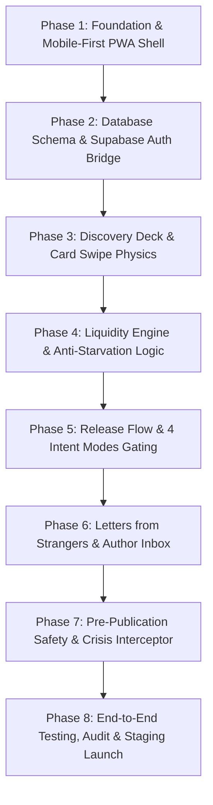

# Product Requirements Document (PRD)
## Project Codename: Sanctuary (Working Title Only — Brand Unlocked)
**Document Version:** 1.1.0 (Refined Architecture Baseline)  
**Status:** Ready for Review & Approval (Pre-Implementation Baseline)  
**Target Platform:** Mobile-First Progressive Web App (PWA) → Native iOS/Android  
**Author / Architecture:** Senior PM, Startup Strategist, Trust & Safety Lead & Full-Stack Architect  

---

## 1. Executive Summary & Product Vision

### 1.1 Executive Summary
**Sanctuary** (working title only) is an intimate, privacy-first, anonymous mobile web platform designed to let human beings release confessions, deep regrets, vulnerable dilemmas, and unsaid thoughts without fear of social judgment, public scrutiny, or identity exposure.

Unlike traditional algorithmic social networks (Reddit, Twitter/X, Instagram, Whisper, YikYak) that monetize outrage, follower counts, and comment warfare, Sanctuary is organized around a focused single-card **Secret Deck**, asynchronous high-empathy **Letters from Strangers**, and a strict **100% Real Human (No-AI-Responses) Covenant**.

Sanctuary does not operate as a mental healthcare provider or clinic. It is an honest human-to-human relief valve designed around one fundamental loop:  
$$\text{Release} \longrightarrow \text{Discover} \longrightarrow \text{Relate} \longrightarrow \text{Respond (Human Letter)} \longrightarrow \text{Receive Perspective} \longrightarrow \text{Closure/Relief}$$

### 1.2 Product Vision
> *"To build the world's most emotionally safe and respectful anonymous sanctuary, where people release the burdens they cannot speak out loud and discover they were never alone."*

### 1.3 Core Product Principles
1. **No Public Identity, No Followers, No Popularity:** Zero user profiles, zero follower counts, zero influencer mechanics, zero public post history.
2. **The Secret is the Hero:** Single-card full-focus discovery. One human voice at a time. No endless feeds.
3. **Intent-Gated Feedback:** The author dictates what type of feedback is permitted: silent resonance (*"Just Listen"*), actionable suggestions (*"Give Me Advice"*), reality checks (*"Tell Me If I'm Wrong"*), or shared journeys (*"Has Anyone Been Here?"*).
4. **100% Real Human Connection (Strict No-AI Responses Covenant):** Every letter is written by a living, breathing human. AI is strictly confined to internal trust & safety (moderation, PII scrubbing, crisis interception). We will never generate synthetic empathy bots.
5. **Anti-Gamification:** No exact reaction counters on author inboxes. Resonance is communicated through qualitative tiers (*"A few people related"*, *"Many people related"*) to prevent shocking clickbait confessions.
6. **Two-Tier Anonymity Architecture:** Zero friction for readers. Writing/releasing requires a lightweight, private verified account (Google/Apple/Email OTP) hidden from all other users to ensure Sybil/bot defense and ban enforcement.

---

## 2. Problem Statement, Positioning & Value Proposition

### 2.1 Problem Statement
Modern digital life has created severe emotional isolation:
* **The "Performative Identity" Trap:** On Instagram, LinkedIn, and Twitter, users curate hyper-successful avatars. Admitting failure, guilt, marital doubt, or career despair carries real-world reputational and social risk.
* **The "Toxic Anonymity" Problem:** Legacy anonymous apps (Whisper, YikYak, AskFM) devolved into trolling, harassment, and comment wars because they lacked intent gating, structural friction against cruelty, and account-level accountability.
* **The Ghost-Town Pitfall:** Anonymous platforms fail when a user posts their deepest vulnerability into the void and receives absolute silence.

### 2.2 Product Positioning Matrix
| Dimension | Traditional Social Media | Legacy Anonymous Apps | Online Therapy Apps | **Sanctuary (Our Platform)** |
| :--- | :--- | :--- | :--- | :--- |
| **Identity Model** | Persistent public profile | Pseudonymous / Geo-public | Real identity & medical records | **Two-Tier: 100% Peer-to-Peer Blind, Platform-Verified** |
| **Discovery** | Algorithmic feed / infinite scroll | Hyper-local list feed | Clinical match portal | **Focused Secret Deck (1 card at a time)** |
| **Response Model** | Public comments & quote-tweets | Unregulated threads & DMs | 1-on-1 therapist sessions | **Intent-Gated Letters (1 letter + 1 closure reply)** |
| **AI Policy** | Algorithmic ranking bots | None / Spam bots | AI therapy bots | **Strict 100% Real Human Responses (Zero AI text)** |
| **Emotional Tone**| Performative & Dopaminergic | Volatile & Lurid | Clinical & Formal ($$$) | **Intimate, quiet, cathartic, grounded** |

---

## 3. Two-Tier Anonymity & Authentication Architecture

To solve the dual challenges of **user privacy** and **platform safety (bot defense, ban enforcement, anti-spam)**, Sanctuary operates a strict two-tier identity model:

```
┌────────────────────────────────────────────────────────────────────────────────────────┐
│                        SANCTUARY TWO-TIER IDENTITY MODEL                               │
├──────────────────────────────────────────┬─────────────────────────────────────────────┤
│ TIER 1: READER LEVEL (Zero Barrier)      │ TIER 2: PARTICIPANT LEVEL (Lightweight)    │
├──────────────────────────────────────────┼─────────────────────────────────────────────┤
│ • Action: Browsing & reading Secret Deck │ • Action: Releasing a Secret or Writing     │
│ • Sign-up: 100% ZERO SIGN-UP REQUIRED    │ • Sign-up: Lightweight Auth Required        │
│ • Storage: Ephemeral local session token │   (Google OAuth, Apple Sign-in, or Magic OTP│
│ • Tracking: Zero user tracking           │ • Identity: 100% BLIND to all other users   │
│                                          │ • Purpose: Sybil resistance & abuse bans    │
└──────────────────────────────────────────┴─────────────────────────────────────────────┘
```

### 3.1 Peer-to-Peer Blind Anonymity
* Authors and Responders **never see each other's email, name, or permanent ID**.
* In any conversation, users are represented solely by ephemeral symbolic aliases (e.g., Author = 🌙, Responder = 🌊).
* Responders cannot search an author's history or cross-reference other secrets they have released.

### 3.2 Platform-Level Accountability
* The backend links actions to an internal, hashed `account_id`.
* If a bad actor sends toxic harassment, the platform can ban the underlying account, revoke all active sessions, and block duplicate registrations without exposing the user's identity to the community.

---

## 4. Anti-Gamification & Qualitative Resonance Framework

### 4.1 The Vulnerability of Exact Numerical Counters
Displaying exact counters (e.g. *"84 Felt This"*, *"1,420 Upvotes"*) induces social media dopamine loops:
* Users learn to write sensationalized, exaggerated, or fabricated confessions to "score" higher numbers.
* Authors whose secrets receive low numerical counts feel rejected and delete their posts.

### 4.2 The Sanctuary Qualitative Resonance Tiers
Exact numerical counters are hidden from the author's inbox and replaced with warm, non-competitive qualitative tiers:

| Raw Reaction Range | Author Inbox Display Text | Emotional Effect |
| :--- | :--- | :--- |
| **0 Reactions** | *"Resting among strangers"* | Dignified patience |
| **1 – 5 Reactions** | *"A few people related to this"* | Gentle human resonance |
| **6 – 25 Reactions** | *"Many people related to this"* | Validated & understood |
| **26+ Reactions** | *"A lot of people felt this too"* | Deep collective comfort |

*On the Secret Deck:* A simple, discrete counter (e.g. `🫂 Felt by others`) is shown to readers without leaderboard rankings or viral sorting.

---

## 5. Liquidity & Anti-Ghost-Town Strategy

The greatest existential risk for an anonymous venting platform is **the void**: a user gathers the courage to release a painful secret, and nobody ever acknowledges it.

```
                               LIQUIDITY BALANCER ALGORITHM
                                           │
                             [ New Secret Released ]
                                           │
                                           ▼
                      ┌─────────────────────────────────────────┐
                      │  STAGE 1: Guaranteed Impression Quota   │
                      │  • Injected into top 5 cards for next   │
                      │    25 active readers.                   │
                      └────────────────────┬────────────────────┘
                                           │
                                           ▼
                      ┌─────────────────────────────────────────┐
                      │  STAGE 2: Anti-Starvation Multiplier    │
                      │  • Secrets with 0 Letters get a 2.5x    │
                      │    distribution weight in the Deck.     │
                      └────────────────────┬────────────────────┘
                                           │
                                           ▼
                      ┌─────────────────────────────────────────┐
                      │  STAGE 3: "Needs Perspective" Discovery │
                      │  • Discrete visual hint in Deck pool    │
                      │    prompting empathetic readers.        │
                      └─────────────────────────────────────────┘
```

### 5.1 Liquidity Mechanics
1. **Guaranteed Impression Quota:** Every published secret is guaranteed to be presented to at least **25 active readers** within its first 6 hours.
2. **Anti-Starvation Multiplier:** The Secret Deck algorithm calculates card distribution using:
   $$\text{Weight} = \text{Freshness Score} + \left( \frac{1}{1 + \text{Letter Count}} \times 2.5 \right)$$
   Secrets with zero letters are dynamically boosted to the front of discovery queues.
3. **Target Time-to-First-Letter (TTFL):**
   * **Target:** Median TTFL $< 4$ hours during active hours (08:00 – 02:00 local time).
   * **Target:** $\ge 80\%$ of secrets requesting advice or experiences receive at least 1 thoughtful human letter within 12 hours.

---

## 6. Contextual PWA Installation Strategy

Rather than aggressive, spammy install popups on first visit, Sanctuary uses a **Value-Triggered Installation Funnel**:

```
[ First Visit / Reading Deck ]  ───► Zero Prompts (Zero Friction Exploration)
             │
             ▼
[ User Releases a Secret ]      ───► Success Screen: "Release complete." (No prompt yet)
             │
             ▼
[ Author Receives 1st Letter ]  ───► Contextual Nudge: "Someone left you a letter. 
                                      Add Sanctuary to your Home Screen for private,
                                      1-tap access to your responses."
```

---

## 7. Streamlined MVP Scope & Features

We aggressively cut decorative fluff (particle burn animations, theme switchers, complex haptics) to focus 100% on the core emotional loop.

```
┌──────────────────────────────────────────────────────────────────────────────────┐
│                            STREAMLINED MVP SCOPE MATRIX                          │
├─────────────────────────────────┬────────────────────────────────────────────────┤
│ MUST HAVE (Core Validation)     │ POSTPONED / EXCLUDED (Post-MVP V1.1+)          │
├─────────────────────────────────┼────────────────────────────────────────────────┤
│ • Mobile-First PWA Deck (Swipe) │ ✕ Midnight Deck time partition                 │
│ • Zero-Auth Reading Experience  │ ✕ Burn particle animations / FX                │
│ • Lightweight Auth for Posting  │ ✕ Dark/Light theme toggle (Locked Dark Theme)  │
│ • "Release Something" Composer  │ ✕ Fancy audio / sound effects                  │
│ • 4 Intent Modes Gating         │ ✕ Multi-turn direct chat                       │
│ • Qualitative Resonance Tiers   │ ✕ Public follower / karma systems              │
│ • 1-Letter + 1-Reply System     │ ✕ AI-generated empathy messages (Strict BAN)   │
│ • Anti-Starvation Deck Engine   │ ✕ Image / Audio / Video uploads                │
│ • Private Author Inbox          │                                                │
│ • Pre-Pub PII & Toxicity Mod    │                                                │
│ • Crisis Resource Overlay       │                                                │
│ • "Burn Secret" (Hard Delete)   │                                                │
└─────────────────────────────────┴────────────────────────────────────────────────┘
```

---

## 8. Detailed Screen Specifications

### Screen 1: The Secret Deck (Discovery Viewport)
* **Purpose:** Single-card, full-focus reader experience. Zero distractions.
* **Layout & Geometry:**
  * Top Bar: Wordmark `SANCTUARY` (discrete), Crisis Support `(?)` icon.
  * Hero Center: Single Card Viewport (`90vw`, `68vh`, `border-radius: 20px`, dark slate background `bg-zinc-900/90` with subtle border).
  * Intent Badge: Top pill indicator (e.g. `[ 💭 Looking for Advice ]`).
  * Secret Content: Centered, highly readable serif/sans typography (`19px`, `1.6` line-height).
  * Bottom Action Bar:
    * Left: `🫂 Relate` (Empathy resonance).
    * Right: `✉️ Write Letter` (Disabled if intent is `JUST_LISTEN`).
  * Deck Controls (Accessibility Fallback):
    * `✕ Skip (Left)` | `✉️ Letter` | `⚑ Report`.

### Screen 2: Lightweight Auth Modal (Triggered on Write Action)
* **Purpose:** Minimal friction sign-in when a reader attempts to release a secret or write a letter for the first time.
* **Content:**
  * Title: *"Protecting human conversations."*
  * Subtitle: *"Sign in with a quick account. You will remain 100% anonymous to all other users forever."*
  * Options:
    * `[ Continue with Google ]`
    * `[ Continue with Apple ]`
    * `[ Send Magic Link via Email ]`
  * Micro-copy: *"No profile. No public name. Strictly for anti-spam & abuse prevention."*

### Screen 3: "Release Something" (The Composer)
* **Purpose:** Distraction-free confession canvas.
* **Layout & Components:**
  * Header: Cancel `✕`, Character Counter `120/1500`, Submit `Release ✦`.
  * Ambient Prompt: *"What are you carrying that you've never said out loud?"*
  * Text Editor: Clean auto-expanding textarea (Min 50, Max 1,500 chars).
  * Intent Selector (4 Options):
    1. `🫂 Just Listen` — "I only want to be heard. No advice."
    2. `💭 Give Me Advice` — "Tell me what you would do."
    3. `🪞 Tell Me If I'm Wrong` — "Give me an honest perspective."
    4. `🤝 Has Anyone Been Here?` — "Share your similar experience."
  * Safety Note: *"Never include real names, phone numbers, or social handles."*

### Screen 4: Letter Composer (Bottom Sheet)
* **Purpose:** Thoughtful, asynchronous response editor.
* **Layout & Components:**
  * Original Secret Snippet: Dimmed context quote at top.
  * Intent Guidance Banner: Reflects author's intent (e.g., *"Author is seeking advice. Please be constructive."*).
  * Textarea: Min 30, Max 1,000 chars.
  * Human Guarantee Badge: *"Written by a real human."*
  * CTA: `Deliver Letter ✉️`.

### Screen 5: Author's Private Inbox
* **Purpose:** Private sanctuary where the author reads human responses and qualitative resonance.
* **Layout & Components:**
  * Header: `Your Releases`.
  * Secret Cards List:
    * Content excerpt + creation age.
    * Qualitative Resonance Tag: `[ Many people related to this ]`.
    * Unread Letter Count Badge.
    * Action: `Burn this Secret 🔥` (Hard Delete).
  * Expanded Secret Thread:
    * Scrollable list of received Letters (each tagged with an ephemeral alias: `🌊 Stranger`, `🌿 Companion`).
    * **One-Time Closure Reply Field:** Author can submit 1 single reply (Max 300 chars, e.g., *"Thank you for your honesty, this helped me breathe tonight"*). Once sent, the thread is sealed.

### Screen 6: Crisis Resource Overlay
* **Purpose:** Compassionate intervention for users expressing self-harm or suicidal intent.
* **Content:**
  * Heading: *"You are not alone. Please let someone support you tonight."*
  * 1-Tap Helpline Dials:
    * `📞 Call AASRA (India): 91-9820466726`
    * `📞 Call Vandrevala Foundation: 9999 666 555`
    * `📞 Call US Crisis Helpline: 988`
    * `💬 Text HOME to 741741 (Crisis Text Line)`
  * Reassurance: *"This service is free, confidential, and available 24/7."*

---

## 9. Technical Architecture & Data Model

```
                                  TECH STACK ARCHITECTURE
┌─────────────────────────────────────────────────────────────────────────────────┐
│                           CLIENT / PWA (Next.js 14+)                            │
│  • React (App Router) + TypeScript + Tailwind CSS                               │
│  • Framer Motion (60fps Card Gestures) + Lucide Icons                           │
│  • Service Worker (Offline Cache & Web Push)                                    │
│  • Client Session Token + Supabase Auth Bridge                                 │
└────────────────────────────────────────┬────────────────────────────────────────┘
                                         │ HTTPS / WSS
                                         ▼
┌─────────────────────────────────────────────────────────────────────────────────┐
│                    EDGE API & MODERATION GATEWAY (Next.js Edge)                 │
│  • Rate Limiting (Upstash Redis Token Bucket)                                   │
│  • PII & Regex Sanitizer                                                        │
│  • AI Safety Classifier (Llama-Guard / OpenAI Moderation / Custom Slurs)        │
│  • Request Auth Verification                                                    │
└────────────────────────────────────────┬────────────────────────────────────────┘
                                         │ Supabase Client / Postgres
                                         ▼
┌─────────────────────────────────────────────────────────────────────────────────┐
│                       BACKEND & DATABASE (PostgreSQL / Supabase)                │
│  • Row-Level Security (RLS) Policies on all tables                             │
│  • Realtime Triggers (Letter delivery to author inbox)                          │
│  • Liquidity Engine (Anti-Starvation scoring function)                          │
└─────────────────────────────────────────────────────────────────────────────────┘
```

### 9.1 Database Schema (PostgreSQL)

```sql
-- Enable Extensions
CREATE EXTENSION IF NOT EXISTS "uuid-ossp";
CREATE EXTENSION IF NOT EXISTS "pgcrypto";

-- ENUMS
CREATE TYPE intent_type AS ENUM ('JUST_LISTEN', 'GIVE_ADVICE', 'TELL_ME_WRONG', 'BEEN_HERE');
CREATE TYPE content_status AS ENUM ('ACTIVE', 'FLAGGED_UNDER_REVIEW', 'REMOVED_BY_MOD', 'BURNED_BY_AUTHOR');
CREATE TYPE report_reason AS ENUM ('HARASSMENT', 'DOXXING_PII', 'HATE_SPEECH', 'EXPLICIT_SEXUAL', 'SELF_HARM', 'SPAM');

-- 1. AUTHENTICATED USER PROFILES (PLATFORM-INTERNAL ONLY)
CREATE TABLE user_profiles (
    id UUID PRIMARY KEY REFERENCES auth.users(id) ON DELETE CASCADE,
    created_at TIMESTAMP WITH TIME ZONE DEFAULT NOW(),
    is_banned BOOLEAN DEFAULT FALSE,
    ban_reason TEXT
);

-- 2. SECRETS TABLE
CREATE TABLE secrets (
    id UUID PRIMARY KEY DEFAULT uuid_generate_v4(),
    author_id UUID NOT NULL REFERENCES user_profiles(id) ON DELETE CASCADE,
    content TEXT NOT NULL CHECK (char_length(content) >= 50 AND char_length(content) <= 1500),
    intent intent_type NOT NULL DEFAULT 'GIVE_ADVICE',
    status content_status NOT NULL DEFAULT 'ACTIVE',
    raw_felt_count INTEGER DEFAULT 0 CHECK (raw_felt_count >= 0),
    letter_count INTEGER DEFAULT 0 CHECK (letter_count >= 0),
    report_count INTEGER DEFAULT 0 CHECK (report_count >= 0),
    language_code VARCHAR(10) DEFAULT 'en',
    created_at TIMESTAMP WITH TIME ZONE DEFAULT NOW()
);

-- Liquidity and Discovery Index
CREATE INDEX idx_secrets_liquidity ON secrets (letter_count ASC, created_at DESC) WHERE status = 'ACTIVE';
CREATE INDEX idx_secrets_author ON secrets (author_id, created_at DESC);

-- 3. LETTERS (RESPONSES) TABLE
CREATE TABLE letters (
    id UUID PRIMARY KEY DEFAULT uuid_generate_v4(),
    secret_id UUID NOT NULL REFERENCES secrets(id) ON DELETE CASCADE,
    responder_id UUID NOT NULL REFERENCES user_profiles(id) ON DELETE CASCADE,
    ephemeral_alias VARCHAR(32) NOT NULL DEFAULT 'Stranger',
    content TEXT NOT NULL CHECK (char_length(content) >= 30 AND char_length(content) <= 1000),
    status content_status NOT NULL DEFAULT 'ACTIVE',
    author_reply TEXT CHECK (author_reply IS NULL OR char_length(author_reply) <= 300),
    author_replied_at TIMESTAMP WITH TIME ZONE,
    is_read_by_author BOOLEAN DEFAULT FALSE,
    created_at TIMESTAMP WITH TIME ZONE DEFAULT NOW(),
    CONSTRAINT unique_letter_per_responder UNIQUE (secret_id, responder_id)
);

CREATE INDEX idx_letters_secret ON letters (secret_id, created_at ASC);
CREATE INDEX idx_letters_responder ON letters (responder_id);

-- 4. "I FELT THIS" REACTIONS TABLE
CREATE TABLE felt_this_reactions (
    id UUID PRIMARY KEY DEFAULT uuid_generate_v4(),
    secret_id UUID NOT NULL REFERENCES secrets(id) ON DELETE CASCADE,
    user_id UUID NOT NULL REFERENCES user_profiles(id) ON DELETE CASCADE,
    created_at TIMESTAMP WITH TIME ZONE DEFAULT NOW(),
    CONSTRAINT unique_felt_per_user UNIQUE (secret_id, user_id)
);

-- 5. REPORTS TABLE
CREATE TABLE reports (
    id UUID PRIMARY KEY DEFAULT uuid_generate_v4(),
    reporter_id UUID NOT NULL REFERENCES user_profiles(id),
    target_type VARCHAR(16) NOT NULL CHECK (target_type IN ('SECRET', 'LETTER')),
    target_id UUID NOT NULL,
    reason report_reason NOT NULL,
    details TEXT,
    created_at TIMESTAMP WITH TIME ZONE DEFAULT NOW()
);

-- 6. CLIENT BLOCKS TABLE (Mute / Safe Shield)
CREATE TABLE client_blocks (
    id UUID PRIMARY KEY DEFAULT uuid_generate_v4(),
    blocker_id UUID NOT NULL REFERENCES user_profiles(id) ON DELETE CASCADE,
    blocked_id UUID NOT NULL REFERENCES user_profiles(id) ON DELETE CASCADE,
    created_at TIMESTAMP WITH TIME ZONE DEFAULT NOW(),
    CONSTRAINT unique_block UNIQUE (blocker_id, blocked_id)
);
```

---

## 10. Trust, Safety & Content Moderation Pipeline

```
                                PRE-PUBLICATION PIPELINE
                                (Latency Budget: < 400ms)
                                           │
                                  [ User Submits Text ]
                                           │
                                           ▼
                       ┌───────────────────────────────────────┐
                       │  STAGE 1: Regex PII Scrubber          │
                       │  • Phone Numbers (Intl & Indian)      │
                       │  • Email Addresses & URLs             │
                       │  • Social Handles (@insta, @snap)     │
                       │  • Aadhaar / SSN / National IDs       │
                       └───────────────────┬───────────────────┘
                                           │ Passed
                                           ▼
                       ┌───────────────────────────────────────┐
                       │  STAGE 2: Toxicity & Slur Matrix      │
                       │  • Hate speech & direct threats       │
                       │  • Hinglish Romanized Slurs           │
                       └───────────────────┬───────────────────┘
                                           │ Passed
                                           ▼
                       ┌───────────────────────────────────────┐
                       │  STAGE 3: Crisis & Harm Detection     │
                       │  • Explicit self-harm or suicide      │
                       │  ➔ Instant Crisis Overlay Triggered   │
                       └───────────────────┬───────────────────┘
                                           │ Passed
                                           ▼
                       ┌───────────────────────────────────────┐
                       │  STAGE 4: Async Edge AI Classifier    │
                       │  • Defamation & Targeted Harassment   │
                       └───────────────────┬───────────────────┘
                                           │
                                           ▼
                                 [ Published to Deck ]
```

---

## 11. Recommended MVP Prioritization & Build Order

```
┌──────────────────────────────────────────────────────────────────────────────────┐
│                            FINAL RECOMMENDED MVP MATRIX                          │
├────────────────────────────────┬─────────────────────────────────────────────────┤
│ MUST HAVE (Launch Baseline)    │ SHOULD HAVE (V1.1 Fast Follow)                  │
├────────────────────────────────┼─────────────────────────────────────────────────┤
│ • Zero-Auth Deck Browsing      │ • 1-Tap Quick Escape Camouflage Button          │
│ • Lightweight Google/Apple/OTP │ • Offline Reading Mode (PWA IndexedDB cache)    │
│ • "Release Something" Flow     │ • Web Push Notification for Received Letters    │
│ • 4 Intent Modes Gating        │ • Email Digest Option ("You received a letter") │
│ • 1-Letter + 1-Reply System    │                                                 │
│ • Qualitative Resonance Tiers  │                                                 │
│ • Anti-Starvation Liquidity    │                                                 │
│ • Private Author Inbox         │                                                 │
│ • "Burn Secret" (Hard Delete)  │                                                 │
│ • PII & Crisis Safety Intercept│                                                 │
├────────────────────────────────┼─────────────────────────────────────────────────┤
│ LATER (V2.0 Roadmap)           │ DO NOT BUILD (Anti-Patterns)                    │
├────────────────────────────────┼─────────────────────────────────────────────────┤
│ • Midnight Deck (Night pool)   │ ✕ AI Empathy / Simulated Response Bots          │
│ • Native iOS & Android apps    │ ✕ Public Profiles, Usernames, or Avatars        │
│ • Audio / Voice Confessions    │ ✕ Follower / Following Systems                  │
│ • Multi-language UI Switcher   │ ✕ Public Comment Sections & Upvote Wars         │
│                                │ ✕ Infinite Scroll Algorithmic Rage Feeds        │
└────────────────────────────────┴─────────────────────────────────────────────────┘
```

### 11.1 Recommended Phased Build Order



1. **Phase 1 — Shell & Responsive Canvas:** Next.js 14, Tailwind, custom dark atmospheric palette, mobile safe-area setup.
2. **Phase 2 — Database & Auth:** Supabase Auth (Google/Apple/Email OTP), RLS policies, two-tier user profile bindings.
3. **Phase 3 — The Secret Deck:** 60fps card gesture stack, accessibility tap fallbacks, empathy reaction trigger.
4. **Phase 4 — Liquidity Engine:** Deck query ordering prioritizing unresponded secrets ($\text{letter\_count} = 0$).
5. **Phase 5 — Release Composer:** Distraction-free confession input, 4 intent modes, character boundaries.
6. **Phase 6 — Letters & Private Inbox:** Structured response sheet, qualitative resonance tags, 1-time closure reply.
7. **Phase 7 — Trust & Safety:** PII regex filters, Hinglish slur check, automated crisis helpline overlay, report workflow.
8. **Phase 8 — Auditing & Launch:** Zero-PII analytics verification, WCAG AA accessibility, mobile performance testing.

---
*End of Refined Product Requirements Document (PRD v1.1.0).*
